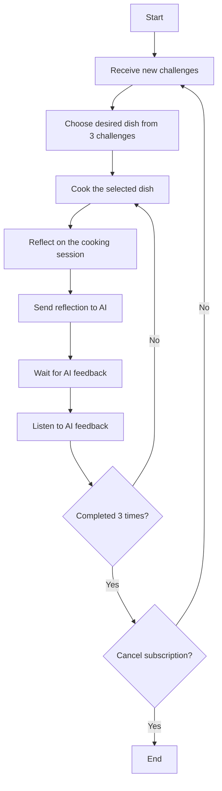

## Overview

On June 6, 2025, I subscribed to [AI Cooking Coaching moment by cookpad](https://www.cookwithmoment.info). This service offers an AI camera and app-based cooking coaching system for 9,800 yen per month (approximately $65-70 USD), allowing users to learn how to cook delicious meals at home like attending a cooking class. After using it for one month with very positive impressions, I continued for a second month, so here's my review.

## What is AI Cooking Coaching moment by cookpad

"AI Cooking Coaching moment by cookpad" is a system that uses AI technology through a camera and app to record and provide feedback on your cooking process. When you use the camera, recording automatically starts as soon as you begin cooking, capturing the entire process of how your dishes are prepared. From the recorded footage, you can easily review your cooking, reflecting on what went well, what didn't work, and any questions you have by speaking them aloud. By sending this reflection to the AI, you receive feedback that can be applied to improve your next cooking session. This cycle of improvement helps you develop lifelong cooking skills while understanding why dishes turn out delicious, enabling you to explain the reasons behind successful cooking.

## Setup

When you subscribe to moment, an AI camera is shipped to you. After receiving the camera, unpack it and set it up in your kitchen. The camera can be mounted using magnets, tape, or 1/4-inch screws. I attached mine to the range hood using a magnet.

The camera requires USB-C power supply. Connect the camera to a power outlet or similar source. Then, connect the camera to WiFi through the app. After connecting the camera, adjust the shooting range by zooming in or out to capture both the stovetop and cutting board where you prepare ingredients. Once set up, recording automatically begins when you start cooking. If you have issues with kitchen and cutting board positioning being too far apart, or if one camera can't capture everything properly, contact support for assistance. They provide thorough and helpful support.

## AI Coaching Flow

After the initial camera setup, you repeat the following cycle:

You receive three challenges and choose one dish to make. After cooking the selected dish and receiving feedback, you repeat this process three times. Through these three iterations, you improve your skills, then move on to the next menu. After completing three dishes, new challenges are provided. This approach allows you to systematically focus on improving skills for specific dishes, and through continued use, you can master a diverse range of recipes.

## Review

### Overall Assessment

While I'll avoid specific details about the first month's menu to prevent spoilers, the system provides a list of dishes that can be easily prepared at home, which you work through sequentially. The common thread among these dishes is the importance of heat control and temperature management. Learning these techniques enables you to easily bring out the flavors of ingredients and dishes. Overall, my satisfaction level is very high.

### First Dish (First Impression)

This was after setting up the camera. I selected an Italian dish from the three options and started cooking immediately. Initially, I didn't even know how to activate the camera or understand how to use it properly. While you simply need to start cooking without thinking about anything else, the very simplicity made it unintuitive for a first-time user of AI-assisted cooking, causing some confusion. Additionally, following the "practice makes perfect" philosophy, the recipes and instructions provided after selecting a dish are quite general. There's no preparation to have all ingredients and procedures perfectly arranged, so without knowledge and techniques for cooking well, you can't initially create high-quality dishes. At this point, I honestly felt confused about what to do, but I decided to just start cooking. The dish turned out not bad but certainly not great, and at this stage, I couldn't feel any effect from the AI camera at all.

### Second and Subsequent Attempts of the First Dish

While I wasn't very motivated due to the poor results, I honestly reflected on what went wrong and sent it to the AI. I rated the first dish 3/5. Waiting leisurely until the morning of the day after next at the latest, feedback arrives as a set of text and video. The feedback not only teaches improvement points for areas that didn't go well but also explains what went well and why. Both unconsciously good practices and improvement points are explained with reasons, so your cooking knowledge improves at this stage. I think it's good to actively ask questions about anything you don't understand. After receiving feedback, you cook the same ingredients and recipe again, incorporating the feedback. In my second attempt, I was able to create a dish that I could rate 5/5. While it takes practice and getting used to accurately incorporate feedback methods, you can definitely feel your cooking skills improving through knowledge and experience.

### Second Dish and Beyond

The process remains the same for the second dish and beyond. However, each dish has its own key points for improvement, and you steadily follow the steps of cooking once (even if it fails), getting feedback, cooking again, and making the dish more delicious. The feedback always includes explanations of why dishes become delicious, so you not only learn about the assigned dish but also cooking concepts applicable to other dishes, with suggestions for similar recipes. This means you not only improve at the specific dish you're making but also realize you can apply the thinking and cooking techniques from feedback to other dishes with similar preparation methods. Through repeating new dishes, reviewing these techniques, and learning new ones, you enhance your versatility while simultaneously learning optimal ways to prepare individual dishes.

### Reflection Process

Reflection uses footage that appears like frame-by-frame video of your recorded cooking, which you can quickly review. While watching this footage and recalling your cooking process, you can voice your thoughts about what went well, what didn't work, and any questions or concerns, adding them to the video. Since you don't need to type, you can easily and consciously reflect on your cooking process, which also helps with memory retention. However, sometimes microphone settings don't capture audio properly, or surrounding noise prevents good recording, so while it's convenient, you need to pay attention to your environment.

### The Value of Using AI Coaching

AI coaching allows you to cook three dishes three times each per month and receive feedback, costing approximately 1,000+ yen (about $7-8 USD) per session. Cooking classes typically cost 3,000-6,000 yen (about $20-40 USD) per session. So the cost per session is reduced to about 20% compared to cooking classes. Cooking classes allow real-time questions to instructors and don't require preparing cooking utensils. With AI coaching, you need to prepare ingredients and equipment yourself, but you can cook with your own tools and preferred ingredients at home anytime and receive AI feedback. The freedom and convenience are excellent, and considering ingredient costs, I believe AI coaching is more affordable and user-friendly than cooking classes.

While you can also cook by looking at recipes, it's difficult to identify high-quality recipes or cook exactly according to recipes. Most recipes have procedures written simply and roughly, containing many implicit details, making it more common to be unable to cook exactly as written. In this regard, cooking classes and AI cameras allow you to properly learn cooking methods and bring out 100% of the quality that recipes aim for, or even exceed 100%. Knowledge and experience for cooking deliciously are essential foundations, and I feel unprecedented value in being able to achieve this cheaply and easily with AI. While the cost and effort of attending cooking classes had been barriers, AI cameras successfully avoid the reasons for not wanting to attend cooking classes while providing high-quality feedback with definite results, so I'm glad I subscribed.

### Images

This is the first Italian dish.

In the image below, the frying pan has changed and this is the fifth time cooking. I've also added my own ingredients for arrangements and enjoyed serving it to family.

For understanding why dishes become delicious and how to make them delicious, I recommend experiencing AI camera feedback yourself. Below is the Italian dish I made after receiving the second feedback.

## Summary

Food is essential for humans. Improving cooking skills through AI cameras enhances daily life satisfaction, makes cooking more enjoyable, and contributes to a fulfilling life. While there are various forms of art like music, painting, and fragrance, I believe cooking well and eating deliciously and joyfully is also a form of art. While eating is physiologically essential, I think changing your perspective and approach can transform it from an obligation into an activity you actively enjoy.

At 9,800 yen per month, it's certainly not cheap, but it's definitely less expensive than cooking classes and provides lifelong skills. For those who can afford the subscription without strain and want to positively enjoy cooking and eating, trying a trial subscription might be worthwhile. If you're interested, consider exploring through [cooking type diagnosis](https://cookpad.involve.me/lp-fm-survey-20250531) and comparing with cooking classes.