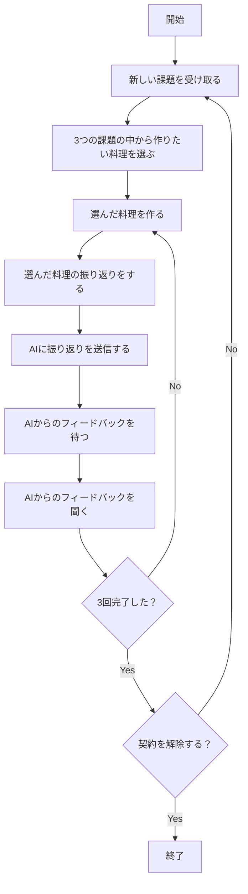

## 概要

2025年6月6日に[料理AIコーチングmoment by cookpad](https://www.cookwithmoment.info)を契約しました。このサービスでは月額9,800円で料理のコーチング機能を持つカメラ・アプリを利用できるサービスを契約でき、自宅にいながら料理教室のように美味しく作るための方法を学べます。一ヶ月利用してとても印象がよく継続で二ヶ月目の契約をしましたので、レビューをします。

## 料理AIコーチングmoment by cookpadとは

「料理AIコーチングmoment by cookpad」はAI技術を活用したカメラとアプリを通じて料理の様子を記録しフィードバックをえるシステムとなっています。カメラを利用すると料理を作り始めるだけで自動的に録画がはじまり、どのようにして料理が作られているのかその過程がしっかり記録として残ります。録画した映像から簡単に調理の様子を振り返りつつうまくいった点・うまくいかなかった点・疑問質問などを声に出してまとめて振り返りをします。振り返りをAIに送信することでAIからのフィードバックを受け取ることができ、フィードバックを通じた改善を次の調理に生かすサイクルを行うことで一生物のスキルとして調理のスキルが身につき、またなぜ美味しく作れるかの理由まで理解し説明ができるようになります。

## セッティング

momentの利用の契約をするとAIカメラが配送されます。カメラを受け取ったあと開封してキッチンにカメラをセットします。カメラはマグネットやテープ、1/4インチサイズのネジなどで取り付けることができます。私は換気扇にマグネットを使って取り付けました。

カメラにはUSB-Cによる電源の給電が必要です。コンセント等からカメラに電源を供給します。その後アプリを通じてカメラをWifiに接続します。カメラの接続後にカメラの撮影範囲を広角にしたりズームにしたりしてコンロとまな板で食材を切る様子などを映せるようにしたらカメラの設置は完了です。設置後は料理を作り始めるだけで勝手に録画がはじまります。キッチンとまな板の位置が離れていたり、一台のカメラでうまく映し出せないなど問題がある場合にはサポートにご連絡いただくと良いかと思います。丁寧で手厚くサポートいただけます。

## AIコーチングの流れ

初期設定としてカメラを設置したあと以下のサイクルを繰り返します。

3つの課題が渡されて1つお題を選びます。選んだお題を作り、フィードバックを受けて作ることを3回繰り返します。3回の繰り返しで上達し、そして次のメニューへと移り、3つ完了したらまた新たにお題が提供される流れです。これにより着実に選んだメニューのスキルを集中してあげることができ、継続して利用することで多様なメニューに太陽できるようになります。

## レビュー

### 総評

まず初月のメニューについてはネタバレとなってしまうので明確な言及は控えますが家庭で簡単に作れるものがリストアップされて順番に対応していくことになります。それぞれの共通点として、火の通し方や温度管理が重要でこれらの技術を活用することにより食材や料理の旨みを簡単に引き出すための知識が身につけられます。なので、最終的な満足度としてはとても高いです。

### １品目（第一印象）

1品目なのでカメラを設置し終えたあとです。三品目の中からイタリアンの一品を選択して料理を早速つくり始めます。最初はカメラをどうやって起動するかもわからずどうやって使うと良いのかがわからない状態でした。何も意識せず料理を始めれば良いだけですがシンプルさゆえに初回だAIを使った料理のはじめかたが直感でわからなかったので戸惑いがありました。加えて、習うよりはまずは慣れろということでお題を選んだ後に渡されるレシピや指示は大雑把なものです。なので、食材や手順もすべて揃って完璧な状態でできるような下準備はないですので、うまく作るための知識や技術がなければまずは高品質に作ることはできないと思います。この時、率直に戸惑いのようなどうすれば良いのかといった感情もありましたが、まずは作ってみました。料理の出来栄えは悪くないですが決して良いものとは言えず、この時点ではAIカメラの効果をまったく感じられませんでした。

### １品目の2回目以降の調理

あまり出来栄えがよくなかったのでこの時点ではあまり気乗りがしない状態ではあったのですが、うまくいかなかったことをありのまま振り返りをしてAIに送信しました。5段階評価で1品目の料理は3/5の出来栄えでした。のんびりと最大で翌々日の朝まで待つと、テキストと動画のセットでフィードバックが送られてきます。フィードバックではうまくできていない改善ポイントを教えてもらえるのですが、それだけでなくうまくいっていることを理由も併せて教えてくれます。今まで無意識にやっていた良いことも、改善ポイントも理由と併せてフィードバックがもらえるのでこの段階で知識としての料理スキルが向上します。わからないことは理解に努めて質問をどんどんしていくと良いと思います。フィードバックを受けてまた同じ食材・レシピでフィードバックを取り入れて料理をつくります。私は2回目の段階で5段階評価で5をつけられるような1品を作ることができました。フィードバックの方法を正確に取り入れるのに訓練や慣れが要ることもありますが、着実に知識と経験で調理のスキルが向上することを体感できると思います。

### 2品目以降

2品目以降もやることは同様です。ただ、料理ごとにうまくなるためのポイントがあり、とりあえず失敗してでも1回作りフィードバックを得てまた作り料理を美味しくさせるステップを着実に踏んでいくことを繰り返します。フィードバックはやはりなぜ美味しくなるかの理由もセットで教えてもらえるので、課題の料理だけでなく他の料理における加工方法の考え方も学習でき、応用料理の提示もあります。なので作っている料理が上手になるだけでなく、類似の加工手順がある他の料理作りに対しても、フィードバックでの考え方や調理の技術を流用できることに気づきます。新しい料理で、こうした技術を復習したり新しく習得したりなど繰り返して応用力を高めつつ、個別の料理を最適に作る方法も同時に学んでいけます。

### 振り返り

振り返りは録画した映像をコマ送りしたかのような映像を使ってクイックに確認できます。この映像をみて調理の手順を思い出しながら声にだしてうまくいった点やうまくいかなかった点、疑問や質問などを映像に付与できます。文字を打つ必要がないので手軽に意識的に料理の手順を振り返ることができるので、記憶の定着にも役立ちます。ただ、マイクの設定でうまく音声を収録できなかったり、周りが騒がしく録音ができなかったりなども時にはありますので、手軽ではありますが環境に注意がいると思います。

### AIコーチングを使う意義

AIコーチングを利用すると1ヶ月に3品目を各3回ずつ調理してフィードバックを受け取ることができます。なので1回あたり1000円強です。料理教室では1回あたり3000~6000円程度　かかります。なので1回あたりの費用は料理教室と比較して20%程度に抑え込めます。料理教室は人にリアルタイムで質問ができ、調理器具の準備も不要です。AIコーチングでは自身で食材や器材など準備する必要がありますが、料理教室に通わずに自宅にある道具と好きな食材でいつでも料理をしてAIからフィードバックを受けられます。自由さと手軽さは非常によく、食材の費用等を考慮してもAIコーチングは料理教室よりも安価に使いやすいと考えています。

またレシピをみて料理を作ることもできますが、高品質なレシピを見抜いたりレシピ通りに作ったりすることは難しいです。レシピがあっても手順が簡単に大雑把に記されていることがほぼ大半でレシピに行間が多く含まれていて、レシピ通りに作れないことの方が多いと思います。その点に対して、料理教室やAIカメラでしっかり加工方法を学べてレシピが狙っている品質の100%を引き出したり、もしくは100%を超えていくこともできるようになると思います。裏付けとして美味しく作るための知識や経験は欠かすことができず、これをAIで安く手軽にできる点で今までになかった価値を感じています。料理教室に通うには費用や手間の方が買ってしまっていたのですが、AIカメラは料理教室に通いたいくない理由をうまく回避しつつも、高品質なフィードバックで確かな効果が得られているので契約して良かったと思っています。

### 画像など

 1品目のイタリアンです。

 

下の画像ではフライパンが変わっており5回目の調理です。食材も自身で追加をしてアレンジを楽しみながら家族に振る舞っています。

なぜ美味しくなるのか、どのようにすると美味しくなるのかはぜひAIカメラのフィードバックで確かめていただくと良いと思います。下は2回目のフィードバックを受けたときに作ったイタリアンの1品です。

## まとめ

人間にとって食事は欠かせないものです。AIカメラを通じて料理の技術を高めることは日々の暮らしの満足度を高めたり、料理を作ることを楽しくさせたりなどの効果があり、人生を充実させることに繋がります。芸術には音楽や絵画、フレグランスなど多様にありますが、料理を上手に作り美味しく楽しく食べることもまた一種の芸術であると思います。食事は生理的に欠かせないものですが、見方ややり方をかえることにより義務でやるものではなく自ら率先して楽しむ行為に変わると私は思います。月額9800円ですので、決して安いとは言えませんが料理教室と比較すると安いのには違いはありませんし、一生役立つスキルです。無理なく課金ができ、料理をつくり食べることを前向きに楽しみたい方はぜひお試しで契約して遊んでみるのも良いかもしれません。ご興味がありましたら[料理のタイプ診断](https://cookpad.involve.me/lp-fm-survey-20250531)や料理教室との比較を通じて検討をしてみてください。

