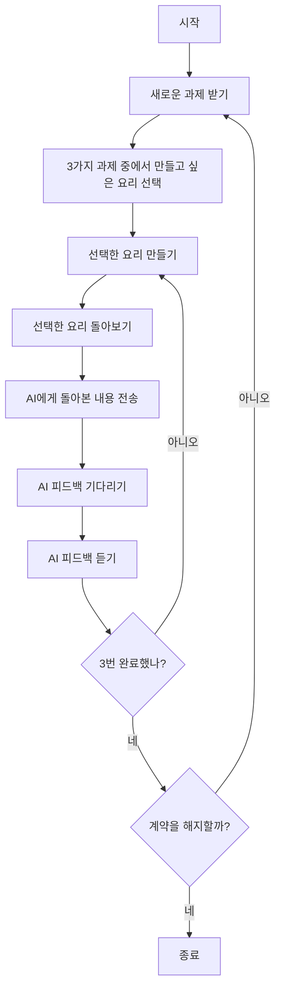

## 개요

2025년 6월 6일에 [요리 AI 코칭 moment by 쿡패드](https://www.cookwithmoment.info)를 계약했습니다. 이 서비스는 월 9,800엔(약 8-9만원)으로 요리 코칭 기능을 가진 카메라와 앱을 이용할 수 있는 서비스로, 집에서 요리 학원처럼 맛있게 만드는 방법을 배울 수 있습니다. 한 달 이용해보니 인상이 매우 좋아서 연장하여 두 번째 달 계약을 했기에 리뷰를 작성합니다.

## 요리 AI 코칭 moment by 쿡패드란

"요리 AI 코칭 moment by 쿡패드"는 AI 기술을 활용한 카메라와 앱을 통해 요리하는 모습을 기록하고 피드백을 받는 시스템입니다. 카메라를 이용하면 요리를 시작하는 것만으로 자동으로 녹화가 시작되어, 어떻게 요리가 만들어지는지 그 과정이 확실히 기록으로 남습니다. 녹화된 영상으로 간단히 조리 과정을 돌아보면서 잘된 점, 잘되지 않은 점, 궁금한 점과 질문 등을 목소리로 정리하여 돌아봅니다. 돌아본 내용을 AI에게 전송하면 AI로부터 피드백을 받을 수 있고, 피드백을 통한 개선을 다음 조리에 활용하는 사이클을 반복하여 평생 사용할 수 있는 스킬로 조리 기술이 향상되며, 왜 맛있게 만들 수 있는지의 이유까지 이해하고 설명할 수 있게 됩니다.

## 설정

moment 이용 계약을 하면 AI 카메라가 배송됩니다. 카메라를 받은 후 개봉하여 주방에 카메라를 설치합니다. 카메라는 자석이나 테이프, 1/4인치 사이즈의 나사 등으로 설치할 수 있습니다. 저는 환풍기에 자석을 사용해서 설치했습니다.

카메라에는 USB-C를 통한 전원 공급이 필요합니다. 콘센트 등에서 카메라로 전원을 공급합니다. 그 후 앱을 통해 카메라를 WiFi에 연결합니다. 카메라 연결 후 카메라의 촬영 범위를 광각으로 하거나 줌으로 하여 가스레인지와 도마에서 식재료를 자르는 모습 등을 촬영할 수 있도록 하면 카메라 설치가 완료됩니다. 설치 후에는 요리를 시작하는 것만으로 자동으로 녹화가 시작됩니다. 주방과 도마의 위치가 떨어져 있거나, 한 대의 카메라로 잘 촬영되지 않는 등의 문제가 있는 경우에는 서포트에 연락하시면 좋을 것 같습니다. 정중하고 세심하게 서포트해 주십니다.

## AI 코칭의 흐름

카메라를 설치한 초기 설정 후 다음 사이클을 반복합니다.

3가지 과제가 주어지고 그 중 하나의 주제를 선택합니다. 선택한 주제로 요리를 만들고, 피드백을 받아 만드는 것을 3번 반복합니다. 3번의 반복으로 실력이 향상되고, 그리고 다음 메뉴로 넘어가, 3개 완료하면 다시 새로운 주제가 제공되는 흐름입니다. 이를 통해 착실히 선택한 메뉴의 스킬을 집중적으로 올릴 수 있고, 지속적으로 이용함으로써 다양한 메뉴에 대응할 수 있게 됩니다.

## 리뷰

### 종합 평가

먼저 첫 달의 메뉴에 대해서는 스포일러가 되어버리므로 명확한 언급은 피하겠지만, 가정에서 간단히 만들 수 있는 것들이 리스트업되어 순서대로 대응해 나가게 됩니다. 각각의 공통점으로는 불 조절이나 온도 관리가 중요하며, 이러한 기술을 활용함으로써 식재료나 요리의 감칠맛을 간단히 끌어낼 수 있는 지식을 익힐 수 있습니다. 그래서 최종적인 만족도는 매우 높습니다.

### 1품목 (첫인상)

1품목이므로 카메라를 설치한 후입니다. 세 품목 중에서 이탈리안 한 품을 선택하여 요리를 바로 만들기 시작합니다. 처음에는 카메라를 어떻게 기동하는지도 모르고 어떻게 사용하면 좋을지를 모르는 상태였습니다. 아무것도 의식하지 않고 요리를 시작하면 되는 것뿐이지만, 단순함 때문에 초회 AI를 사용한 요리 시작 방법이 직관적으로 모르겠어서 당황했습니다. 게다가 배우는 것보다는 우선 익숙해지라는 것으로 주제를 선택한 후에 주어지는 레시피나 지시는 대략적인 것입니다. 그래서 식재료나 절차도 모든 것이 갖춰져 완벽한 상태로 할 수 있는 준비는 없으므로, 잘 만들기 위한 지식이나 기술이 없으면 우선 고품질로 만들 수는 없다고 생각합니다. 이때 솔직히 당황스러운 어떻게 하면 좋을지 하는 감정도 있었지만, 우선 만들어 보았습니다. 요리의 출来는 나쁘지 않지만 결코 좋다고는 할 수 없고, 이 시점에서는 AI 카메라의 효과를 전혀 느낄 수 없었습니다.

### 1품목의 2번째 이후 조리

출来가 별로 좋지 않아서 이 시점에서는 별로 내키지 않는 상태였지만, 잘되지 않은 것을 있는 그대로 돌아보고 AI에게 전송했습니다. 5단계 평가로 1품목 요리는 3/5의 출来였습니다. 느긋하게 최대 모레 아침까지 기다리면, 텍스트와 동영상 세트로 피드백이 전송됩니다. 피드백에서는 잘되지 않은 개선 포인트를 알려주는데, 그뿐만 아니라 잘된 것을 이유와 함께 알려줍니다. 지금까지 무의식적으로 했던 좋은 것도, 개선 포인트도 이유와 함께 피드백을 받을 수 있으므로 이 단계에서 지식으로서의 요리 스킬이 향상됩니다. 모르는 것은 이해에 노력하여 질문을 계속하면 좋을 것 같습니다. 피드백을 받고 다시 같은 식재료・레시피로 피드백을 도입하여 요리를 만듭니다. 저는 2번째 단계에서 5단계 평가로 5를 받을 수 있는 한 품을 만들 수 있었습니다. 피드백 방법을 정확히 도입하는 데 훈련이나 익숙해짐이 필요한 것도 있지만, 착실히 지식과 경험으로 조리 스킬이 향상되는 것을 체감할 수 있다고 생각합니다.

### 2품목 이후

2품목 이후도 할 일은 동일합니다. 다만, 요리마다 잘되기 위한 포인트가 있고, 일단 실패해도 1회 만들고 피드백을 얻어 다시 만들어 요리를 맛있게 하는 스텝을 착실히 밟아가는 것을 반복합니다. 피드백은 역시 왜 맛있어지는지의 이유도 세트로 알려주므로, 과제 요리뿐만 아니라 다른 요리에서의 가공 방법 사고방식도 학습할 수 있고, 응용 요리 제시도 있습니다. 그래서 만들고 있는 요리가 잘되는 것뿐만 아니라, 유사한 가공 절차가 있는 다른 요리 만들기에 대해서도, 피드백에서의 사고방식이나 조리 기술을 유용할 수 있다는 것을 깨닫습니다. 새로운 요리로, 이러한 기술을 복습하거나 새롭게 습득하거나 등을 반복하여 응용력을 높이면서, 개별 요리를 최적으로 만드는 방법도 동시에 배워갈 수 있습니다.

### 돌아보기

돌아보기는 녹화한 영상을 프레임 단위로 보낸 것 같은 영상을 사용해서 빠르게 확인할 수 있습니다. 이 영상을 보고 조리 절차를 떠올리면서 목소리로 잘된 점이나 잘되지 않은 점, 의문이나 질문 등을 영상에 부여할 수 있습니다. 문자를 입력할 필요가 없으므로 간편하게 의식적으로 요리 절차를 돌아볼 수 있어서, 기억 정착에도 도움이 됩니다. 다만, 마이크 설정으로 잘 음성을 수록할 수 없거나, 주위가 시끄러워 녹음이 안 되거나 하는 것도 때로는 있으므로, 간편하지만 환경에 주의가 필요하다고 생각합니다.

### AI 코칭을 사용하는 의의

AI 코칭을 이용하면 한 달에 3품목을 각각 3번씩 조리하여 피드백을 받을 수 있습니다. 그래서 1회당 1000엔 정도입니다. 요리 학원에서는 1회당 3000~6000엔 정도 걸립니다. 그래서 1회당 비용은 요리 학원과 비교하여 20% 정도로 억제할 수 있습니다. 요리 학원은 사람에게 실시간으로 질문할 수 있고, 조리 기구 준비도 불필요합니다. AI 코칭에서는 자신이 식재료나 기재 등을 준비해야 하지만, 요리 학원에 다니지 않고 집에 있는 도구와 좋아하는 식재료로 언제든지 요리하여 AI로부터 피드백을 받을 수 있습니다. 자유로움과 간편함은 매우 좋고, 식재료 비용 등을 고려해도 AI 코칭은 요리 학원보다 저렴하게 사용하기 쉽다고 생각합니다.

또한 레시피를 보고 요리를 만들 수도 있지만, 고품질 레시피를 간파하거나 레시피대로 만들거나 하는 것은 어렵습니다. 레시피가 있어도 절차가 간단하게 대략적으로 기재되어 있는 것이 거의 대부분으로 레시피에 행간이 많이 포함되어 있어서, 레시피대로 만들 수 없는 경우가 더 많다고 생각합니다. 그 점에 대해서, 요리 학원이나 AI 카메라로 확실히 가공 방법을 배워서 레시피가 노리는 품질의 100%를 끌어내거나, 혹은 100%를 넘어설 수도 있게 된다고 생각합니다. 뒷받침으로 맛있게 만들기 위한 지식이나 경험은 빠뜨릴 수 없고, 이를 AI로 저렴하고 간편하게 할 수 있는 점에서 지금까지 없었던 가치를 느끼고 있습니다. 요리 학원에 다니기에는 비용이나 수고가 크다고 생각했는데, AI 카메라는 요리 학원에 다니고 싶지 않은 이유를 잘 회피하면서도, 고품질 피드백으로 확실한 효과를 얻고 있어서 계약해서 좋았다고 생각합니다.

### 이미지 등

1품목의 이탈리안입니다.

아래 이미지에서는 프라이팬이 바뀌어 있고 5번째 조리입니다. 식재료도 자신이 추가하여 어레인지를 즐기면서 가족에게 대접하고 있습니다.

왜 맛있어지는지, 어떻게 하면 맛있어지는지는 꼭 AI 카메라의 피드백으로 확인해 보시면 좋을 것 같습니다. 아래는 2번째 피드백을 받았을 때 만든 이탈리안 한 품입니다.

## 정리

인간에게 식사는 빼놓을 수 없는 것입니다. AI 카메라를 통해 요리 기술을 높이는 것은 일상생활의 만족도를 높이거나, 요리를 만드는 것을 즐겁게 하거나 하는 등의 효과가 있어, 인생을 충실하게 하는 것으로 이어집니다. 예술에는 음악이나 회화, 향수 등 다양하게 있지만, 요리를 잘 만들어 맛있고 즐겁게 먹는 것도 또한 일종의 예술이라고 생각합니다. 식사는 생리적으로 빼놓을 수 없는 것이지만, 보는 방법이나 하는 방법을 바꿈으로써 의무로 하는 것이 아니라 스스로 솔선하여 즐기는 행위로 바뀐다고 저는 생각합니다. 월 9800엔이므로, 결코 저렴하다고는 할 수 없지만 요리 학원과 비교하면 저렴한 것에는 틀림이 없고, 평생 도움이 되는 스킬입니다. 무리 없이 과금할 수 있고, 요리를 만들어 먹는 것을 적극적으로 즐기고 싶은 분은 꼭 체험으로 계약해서 놀아보는 것도 좋을지도 모릅니다. 관심이 있으시면 [요리 타입 진단](https://cookpad.involve.me/lp-fm-survey-20250531)이나 요리 학원과의 비교를 통해 검토해 보세요.